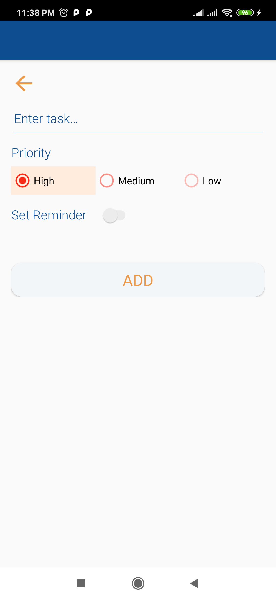
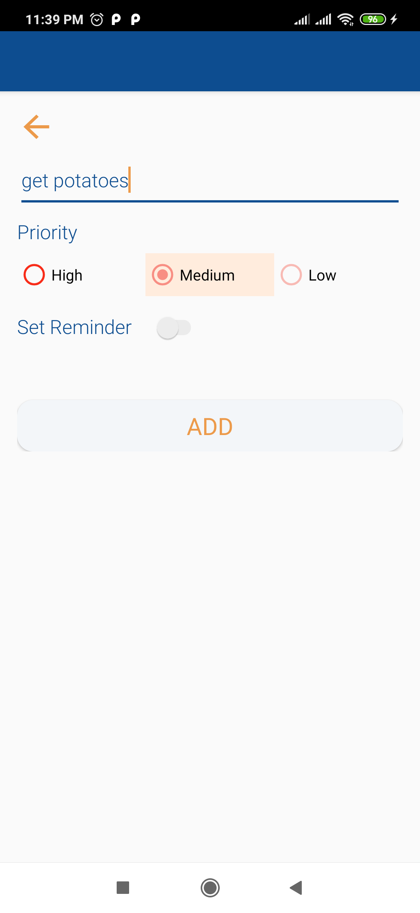
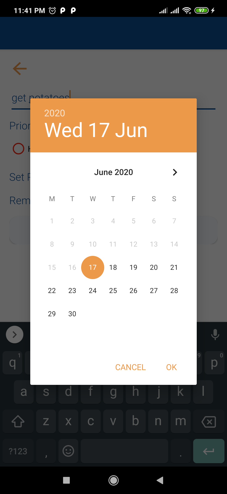
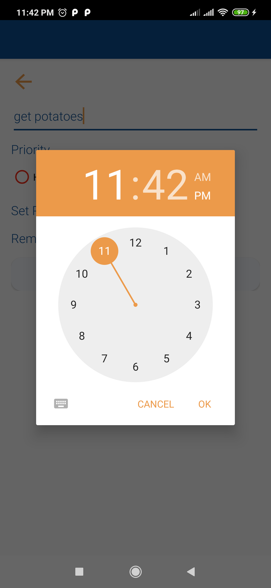
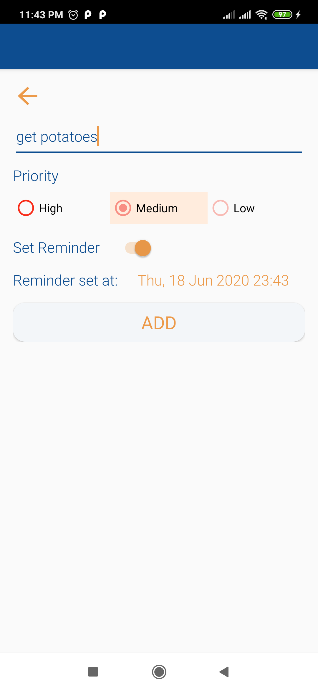
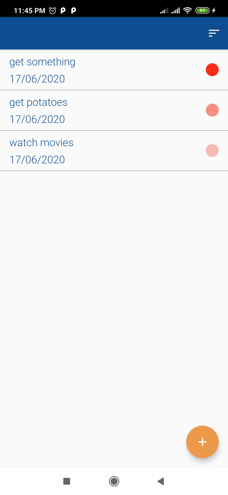
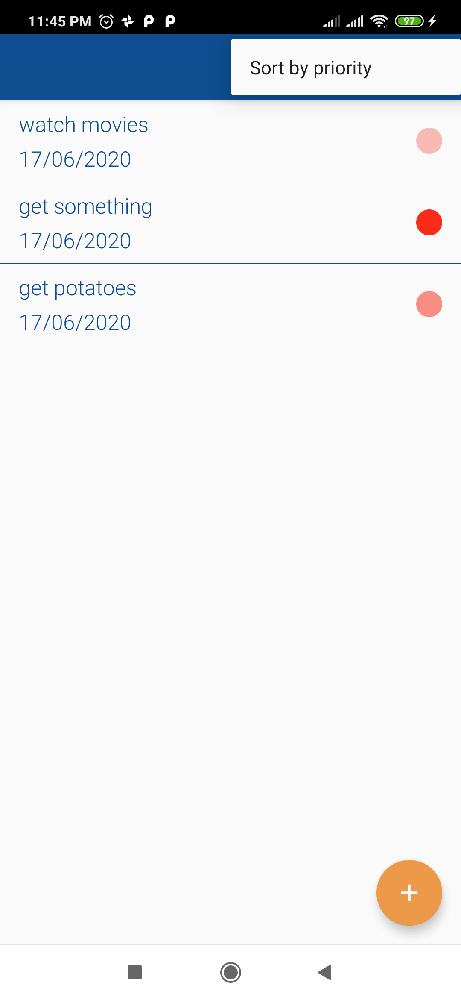
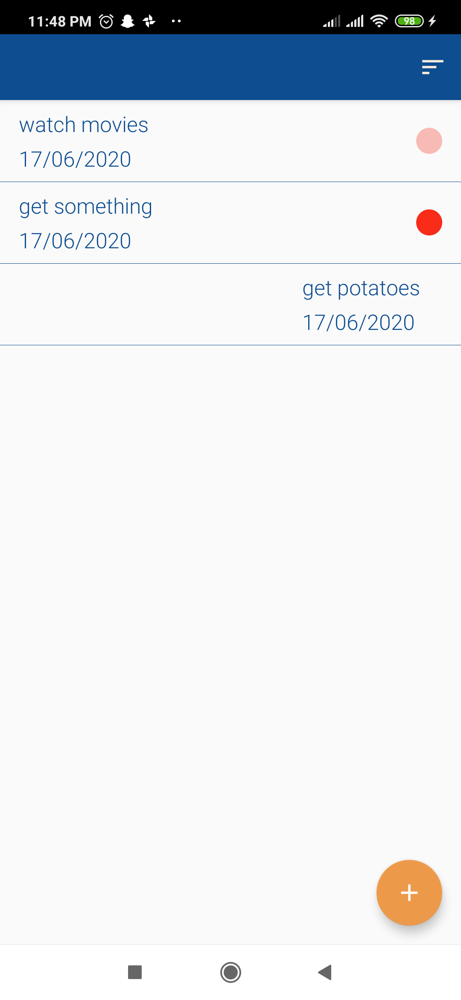
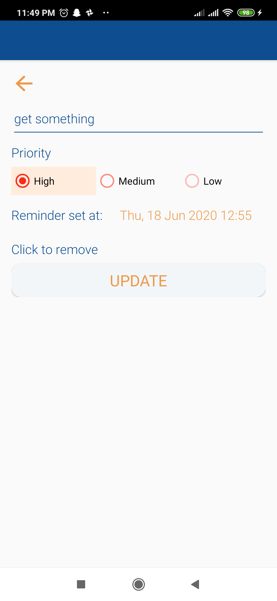
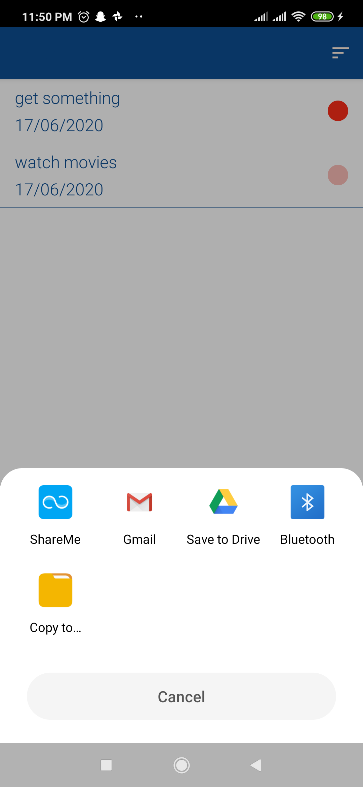

## Introduction

Simple to-do app that allows user to generate and view a list of  errands and other tasks. This app allows user to add/update/delete task and reminder for that task. This app uses android architecture components like Room Database, Live Data and View Model.  Recycler View is used to list all the tasks entered by user where the user can swipe to delete any particular item. Displayed list of items can also be sorted by priority or by recent date. This app also allows user to share any particular task via Email by long tapping on the item. Reminder is allowed to be set, removed and updated for any task. Reminder send a notification to the user on the user set time and date.

## Android Architecture Component
* UI Controller (activity/fragment)
* ViewModel
* Live Data
* Repository
* Room Database (Entity, Dao)

## Features

* Add task with priority

* Set time and date for task reminder

* View task, sort by priority or recent date

* Swipe in any direction to delete a task

* Click on any item to update it
* Swipe left and right to view previous/next item

* Long tap on any item to share the content via email
